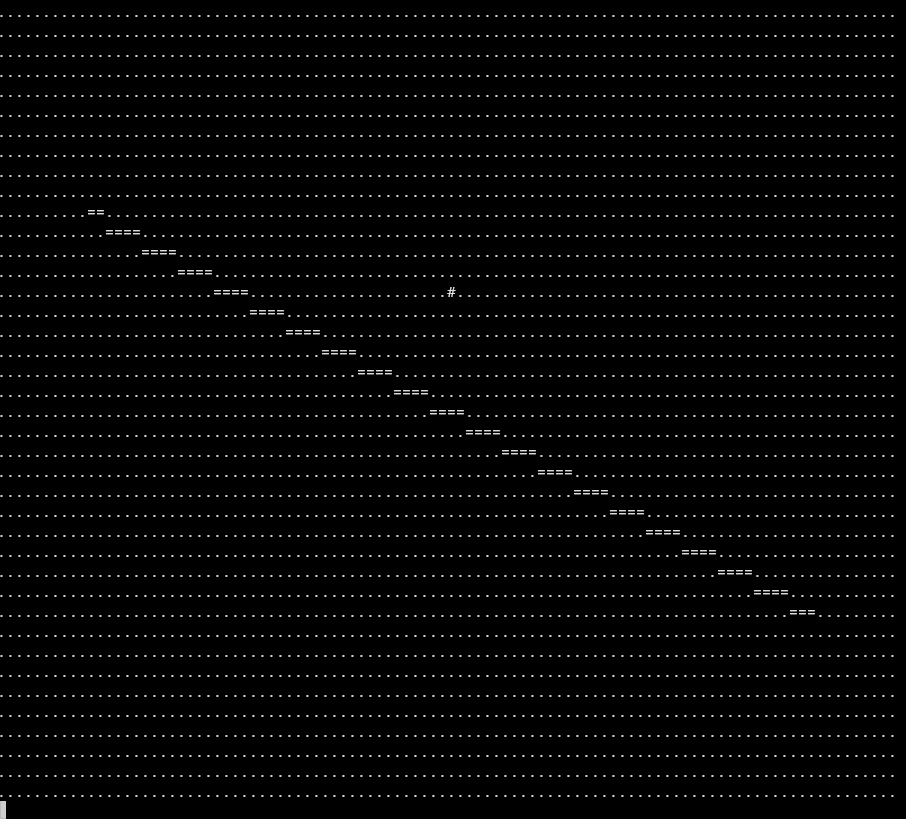
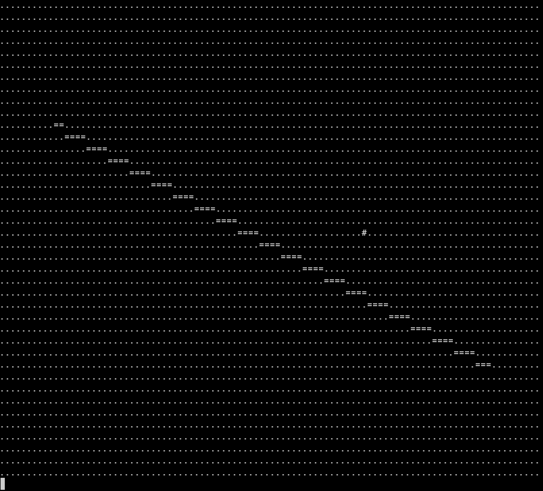

# ASDER

A basic ASCII art console renderer written in **pure C**.

<p align="center">
  
  
</p>

This project was created as an experiment to gain a deeper understanding of two-dimensional arrays and the direct manipulation of contiguous memory blocks in C without relying on external dependencies.

## Features
* Uses a 2D framebuffer.
* Efficient memory manipulation using the C standard library (`memset`).
* Modular architecture ready to serve as the foundation for a rendering engine.

## Requirements
* GCC compiler.
* Make.

## Build and Run

To build the project, simply run:

```bash
make
```

To run the renderer:

```bash
make run
```

To remove compiled files:

```bash
make clean
```

# License

GNU General Public License v3.0
